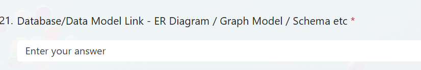

# RetailAI Research Agent

An Enterprise AI Research Agent for the retail industry. This application allows users to ask research questions about retail companies, products, markets, and trends, and produces a structured, evidence-based research report.

## Architecture

**[View Full Architecture Diagram & Data Model](https://drive.google.com/file/d/1CSLsb7r7uG0nI18v8ZsR8EPEu-rfhUJy/view?usp=sharing)**

The application is structured to be modular, separating concerns into distinct layers:

- **Frontend (Streamlit):** User interface for querying and displaying research reports.
- **Backend (FastAPI):** REST APIs serving requests from the frontend and integrating with the AI workflows.
- **Data & Knowledge Layer:** 
  - Relational Data (SQLAlchemy / SQLite) for session history and structured output.
  - Vector Data (ChromaDB & Gemini Embeddings) for RAG context.
  - Live External Knowledge via Wikipedia / Web Search APIs.
- **AI Workflow (LangGraph):** Orchestrates multi-step research plans, evidence collection, and report generation.
- **Retrieval (ChromaDB):** Semantic search and retrieval over collected evidence.
- **Database (SQLite & SQLAlchemy):** Persistent storage for research sessions, tasks, and structured data.
- **LLM Abstraction:** Designed to support multiple LLM providers (e.g., OpenAI, Anthropic).

### Directory Structure

- `backend/app/api`: FastAPI routes/endpoints.
- `backend/app/core`: Configuration, logging, and core utilities.
- `backend/app/models`: SQLAlchemy database models.
- `backend/app/schemas`: Pydantic models for validation.
- `backend/app/services`: Business logic and external service integrations.
- `backend/app/ai`: LangGraph workflows and LLM agent definitions.
- `backend/app/retrieval`: RAG and vector database (ChromaDB) interactions.
- `frontend`: Streamlit application.
- `data`: Persistent storage directory (SQLite, Chroma).

## Setup Instructions

1. **Clone the repository.**
2. **Create a virtual environment:**
   ```bash
   python -m venv venv
   source venv/bin/activate  # On Windows: venv\Scripts\activate
   ```
3. **Install dependencies:**
   ```bash
   pip install -r requirements.txt
   ```
4. **Configure environment:**
   Copy `.env.example` to `.env` and fill in your API keys (e.g., `OPENAI_API_KEY`).
   ```bash
   cp .env.example .env
   ```
5. **Run the Backend (FastAPI):**
   ```bash
   uvicorn backend.app.main:app --reload
   ```
6. **Run the Frontend (Streamlit):**
   ```bash
   streamlit run frontend/streamlit_app.py
   ```

## Next Steps
The foundation is laid out. The next phase will involve setting up the core configuration, database connections, and basic API endpoints before building out the AI workflow.

## Database Design

The database schema is designed to preserve traceability from research questions down to final recommendations:



- **Organization**: Top-level entity representing a company or client.
- **ResearchSession**: A single research job or question.
- **Source**: External sources (articles, sites, APIs) retrieved during the session. (Enforces unique URL per session).
- **EvidenceItem**: Specific text snippets or facts extracted from a source.
- **Finding**: AI-generated synthesis based on collected evidence.
- **FindingEvidence**: A many-to-many relationship tracking whether specific EvidenceItem records *support* or *contradict* a Finding.
- **Recommendation**: Actionable advice generated from findings.
- **WorkflowLog**: Execution logs tracking LangGraph nodes for debugging and explainability.

**Traceability Chain:**
Research Question -> Research Session -> Sources -> Evidence -> Findings -> Recommendations

## API Architecture

The application uses FastAPI to implement a scalable REST API. The architecture strictly enforces separated layers:

`Frontend -> FastAPI API -> Service Layer -> SQLAlchemy ORM -> SQLite Database`

- **Routers (`backend/app/api/`)**: Defines HTTP endpoints and dependency injections.
- **Schemas (`backend/app/schemas/`)**: Pydantic models for request/response validation.
- **Services (`backend/app/services/`)**: Business logic and DB interactions.

### Available Endpoints

- `GET /health` : Check API status.
- `POST /api/research` : Create a new research session.
- `GET /api/research/{session_id}` : Retrieve a single session by ID.
- `GET /api/research` : Retrieve paginated sessions.

### Example Request/Response

**POST /api/research**
```bash
curl -X POST "http://localhost:8000/api/research" \
     -H "Content-Type: application/json" \
     -d '{"question": "How will generative AI impact retail in 2026?"}'
```

**Response (201 Created)**
```json
{
  "id": 1,
  "organization_id": null,
  "research_question": "How will generative AI impact retail in 2026?",
  "status": "pending",
  "created_at": "2026-08-28T00:00:00.000Z",
  "completed_at": null,
  "error_message": null
}
```

### Starting the FastAPI Server

To run the server in development mode:
```bash
uvicorn backend.app.main:app --reload
```
The API documentation will be available at `http://localhost:8000/docs`.

### Running Tests

To run the full test suite (Database and API tests):
```bash
pytest backend/tests/ -v
```
