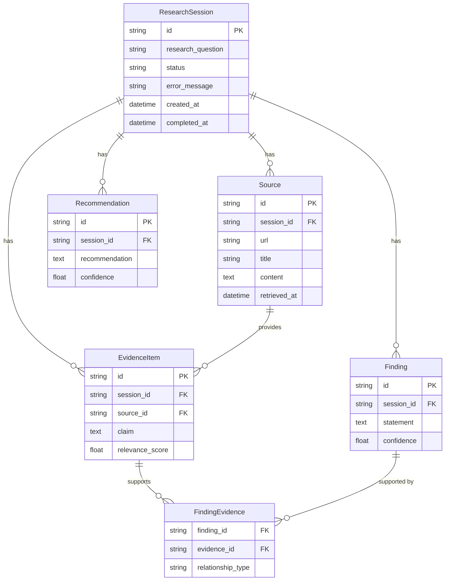

# Modus Enterprise AI Build Challenge - Submission Details

## 1. Source Code Repository
**Action Required:** You need to push this local folder (`C:\Users\acer\Desktop\RetailAI-Research-Agent`) to a public or private GitHub repository and provide the URL in the submission form.

## 2. README / Setup Instructions
The `README.md` file in the root directory contains the setup instructions. Make sure to mention that the environment relies on the `.env` file requiring a Google Gemini API Key (`GEMINI_API_KEY`).

## 3. Architecture Diagram
**Application Architecture:**
- **User Interface:** Streamlit Web Dashboard (`frontend/streamlit_app.py`)
- **Application/API Layer:** FastAPI Backend (`backend/app/main.py`)
- **AI Intelligence Layer:** LangGraph State Machine orchestrating `gemini-2.5-flash` for multi-step reasoning (Planner -> Search -> Retrieval -> Evidence -> Findings -> Recommendations).
- **Data & Knowledge Layer:** SQLite (`data/retail_ai.db`) for relational session data, and ChromaDB (`data/chroma_db`) for vector storage.
- **External Research / Data:** DuckDuckGo Search API for live web intelligence gathering.

*(You can draw a quick flowchart in draw.io or Excalidraw representing the above points if they require an image file).*

## 4. Database / Data Model

**Entity Relationship Diagram (ERD):**

**Vector Model (ChromaDB):**
- Collection: `retail_research`
- Embeddings: `models/gemini-embedding-2` (768 dimensions)
- Stores text chunks mapped to `source_id` for retrieval-augmented generation.

## 5. Model and Library Inventory with Licences
All tools used are free, open-source, or have accessible free tiers:
- **LLM / Intelligence:** Google Gemini `gemini-2.5-flash` (Free Tier API)
- **Embeddings:** Google Gemini `models/gemini-embedding-2` (Free Tier API)
- **Search API:** DuckDuckGo Search (Free/Open API via `duckduckgo-search` MIT License)
- **Backend Framework:** FastAPI (MIT License)
- **Frontend Framework:** Streamlit (Apache 2.0 License)
- **AI Orchestration:** LangChain / LangGraph (MIT License)
- **Vector Database:** ChromaDB (Apache 2.0 License)
- **Relational Database:** SQLite (Public Domain) & SQLAlchemy (MIT License)

**If free-tier becomes unavailable:** The architecture is designed via LangChain wrappers. The models can easily be hot-swapped to local open-source LLMs (e.g., Llama 3 via Ollama) and local embeddings (e.g., `sentence-transformers`) with zero architectural changes.

## 6. AI Coding Tools Disclosure
**Action Required:** In the form, disclose that you collaborated with the "Antigravity Agent" (an AI coding assistant) to accelerate boilerplate generation, debug API rate limits, and construct the LangGraph state machine. Emphasize that you directed the architecture choices (FastAPI + Streamlit + Chroma) and understand the data flow.

## 7. The 1000 Process Test (Evaluator Question Prep)
**"If we give your application 1,000 processes tomorrow instead of 100, what happens?"**
*Your answer should be:* 
"The application is built on an asynchronous FastAPI backend and an event-driven LangGraph state machine. However, the Google Gemini Free Tier strictly limits us to 15 Requests Per Minute. If we pass 1,000 processes, it will instantly hit the rate limit. To scale this for enterprise, we would upgrade to the paid pay-as-you-go Gemini API tier, increase our ChromaDB deployment to a dedicated server (rather than local disk), and utilize a background task queue like Celery or Redis to process the 1,000 requests asynchronously without timing out the client."
